# master_plan

A new Flutter project.

# Nama: Tirta Nurrochman Bintang Prawira
# NIM: 2241720045
# Kelas/Absen: TI-3A/27

# Tugas Praktikum 1
1. Selesaikan langkah-langkah praktikum tersebut, lalu dokumentasikan berupa GIF hasil akhir praktikum beserta penjelasannya di file README.md! Jika Anda menemukan ada yang error atau tidak berjalan dengan baik, silakan diperbaiki.
# Kode Program:
- ## task.dart
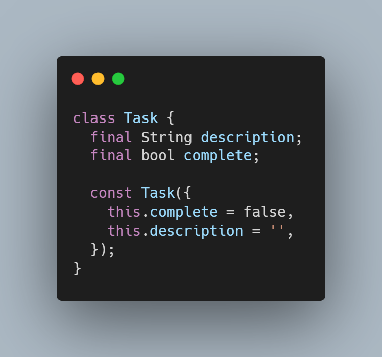
- ## plan.dart
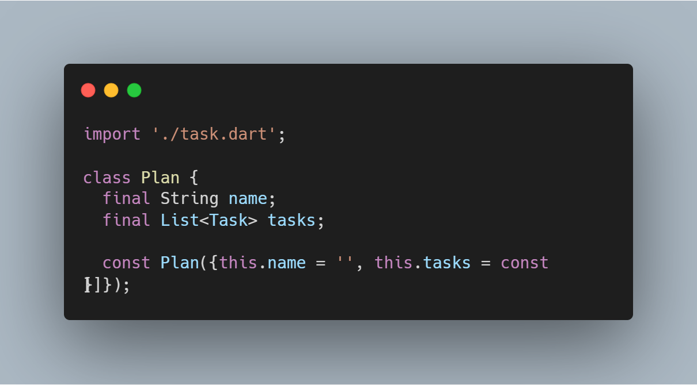
- ## data_layer.dart
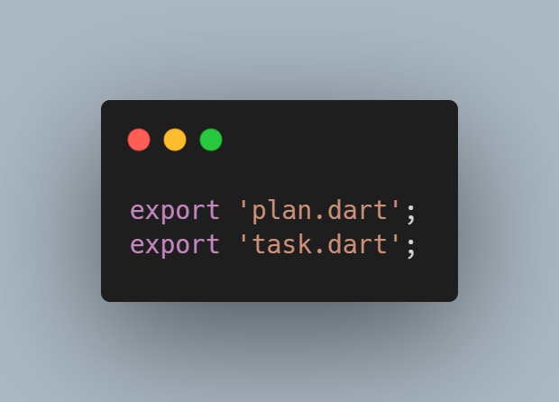
- ## main.dart
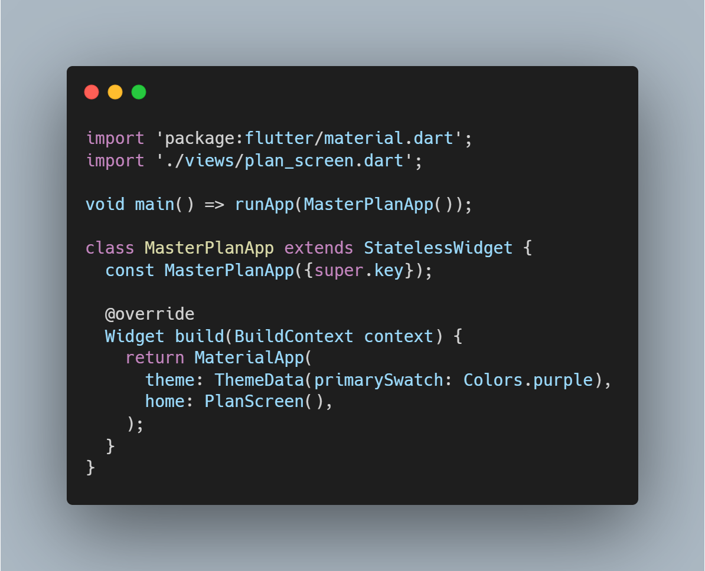
- ## plan_screen.dart
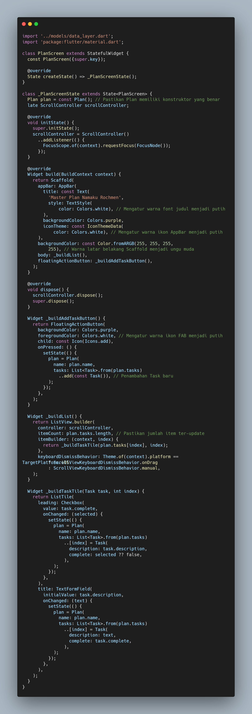
# Output
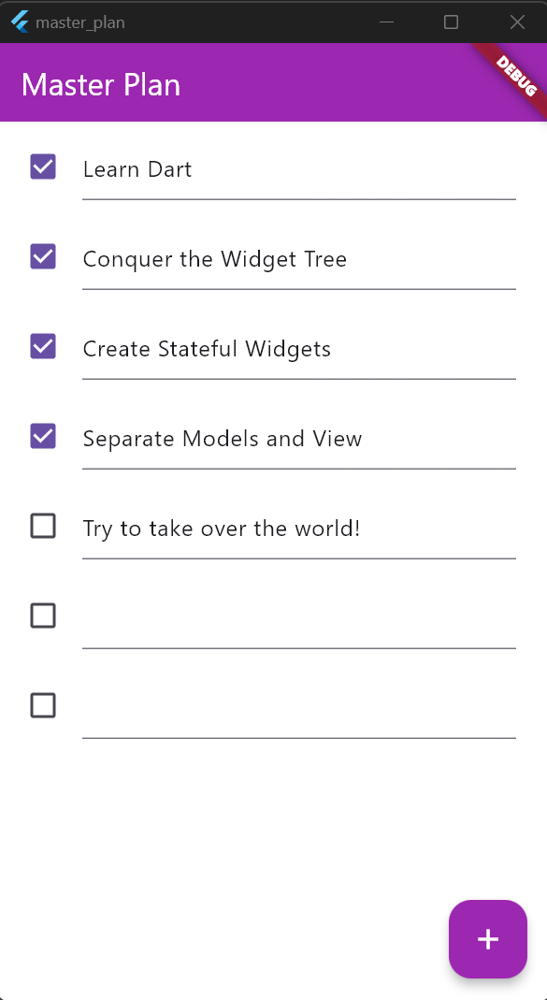

2. Jelaskan maksud dari langkah 4 pada praktikum tersebut! Mengapa dilakukan demikian?
- Jawab: Langkah 4 bertujuan untuk menyederhanakan proses pengimporan model dengan membuat file `data_layer.dart` yang menggabungkan beberapa file model (seperti `plan.dart` dan `task.dart`) menggunakan perintah `export`. Dengan begitu, file lain yang membutuhkan model-model ini hanya perlu mengimpor `data_layer.dart` daripada mengimpor setiap file model secara terpisah. Pendekatan ini membuat kode lebih rapi dan mudah dikelola seiring berkembangnya aplikasi, karena cukup menambahkan ekspor di `data_layer.dart` ketika model baru dibuat, tanpa perlu mengubah impor di setiap file.

3. Mengapa perlu variabel plan di langkah 6 pada praktikum tersebut? Mengapa dibuat konstanta ?
- Jawab: Variabel `plan` pada langkah 6 digunakan untuk menyimpan objek `Plan`, yang berfungsi sebagai wadah data utama bagi layar `PlanScreen` untuk mengelola dan menampilkan daftar tugas atau rencana. Variabel ini dibuat sebagai konstanta (`const Plan()`) karena objek `Plan` tidak memiliki data yang dinamis saat inisialisasi, sehingga tidak memerlukan perubahan setelah dibuat. Penggunaan `const` juga membuat penggunaan memori lebih efisien, karena compiler dapat mengoptimalkan objek ini. Selain itu, satu instance `Plan` yang tetap cukup untuk menjadi referensi awal data yang akan digunakan pada layar `PlanScreen`.

4. Lakukan capture hasil dari Langkah 9 berupa GIF, kemudian jelaskan apa yang telah Anda buat!
- Jawab: Widget `_buildTaskTile` digunakan untuk menampilkan setiap tugas dalam daftar `plan.tasks` sebagai `ListTile` yang dinamis, dengan kotak centang (`Checkbox`) dan `TextFormField` untuk memungkinkan pengguna menandai tugas sebagai selesai atau mengubah deskripsinya secara langsung. Kotak centang akan mengubah status `complete` dari tugas tersebut, sementara perubahan teks deskripsi diperbarui melalui `onChanged`, sehingga objek `plan` diperbarui setiap kali ada interaksi. Widget ini mempermudah pengguna dalam mengelola daftar tugas, baik menandai tugas maupun mengeditnya, dan memastikan tampilan selalu sinkron dengan data yang ada.

5. Apa kegunaan method pada Langkah 11 dan 13 dalam lifecyle state ?
- Jawab: Metode `initState()` dan `dispose()` digunakan dalam siklus hidup state untuk menginisialisasi dan membersihkan objek `scrollController`. Pada `initState()`, `scrollController` dibuat dan ditambahkan *listener* untuk menyembunyikan keyboard secara otomatis saat pengguna menggulir, membantu menjaga tampilan tetap bersih. Pada `dispose()`, `scrollController` dibersihkan saat widget tidak lagi digunakan, yang membebaskan sumber daya dan mencegah kebocoran memori. Keduanya memastikan kontrol scroll bekerja optimal sesuai siklus hidup widget tanpa membebani aplikasi.

6. Kumpulkan laporan praktikum Anda berupa link commit atau repository GitHub ke dosen yang telah disepakati !
- Jawab: Sudah

# Tugas Praktikum 2
1. Selesaikan langkah-langkah praktikum tersebut, lalu dokumentasikan berupa GIF hasil akhir praktikum beserta penjelasannya di file README.md! Jika Anda menemukan ada yang error atau tidak berjalan dengan baik, silakan diperbaiki sesuai dengan tujuan aplikasi tersebut dibuat.
# Kode Program:
- ## plan_provider.dart
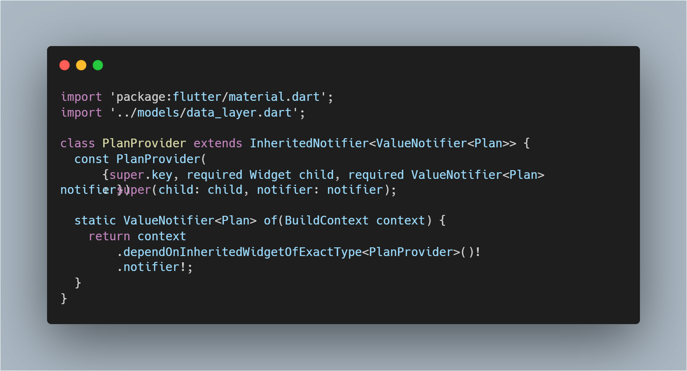
- ## main.dart
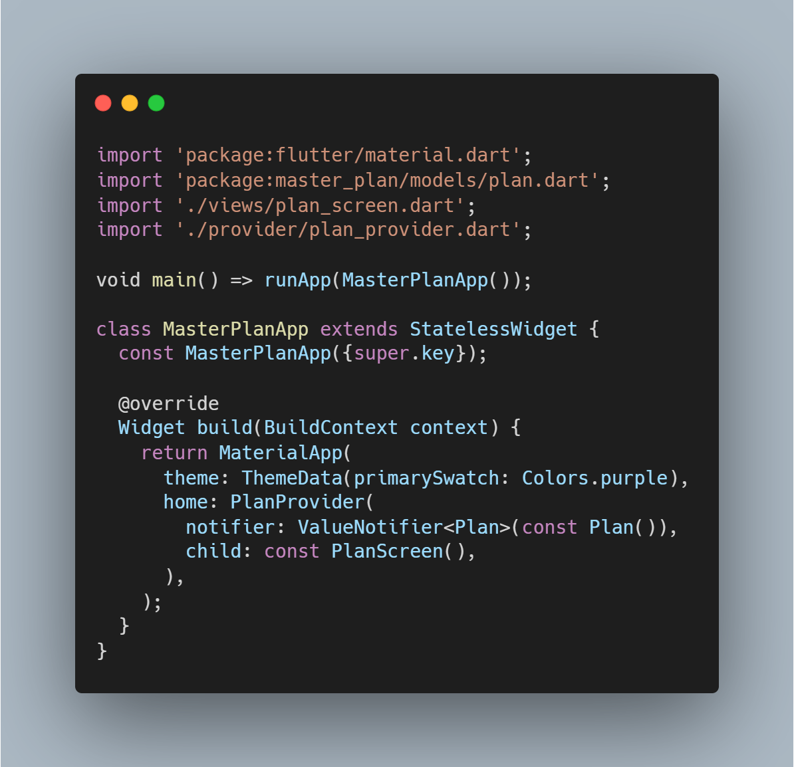
- ## plan.dart
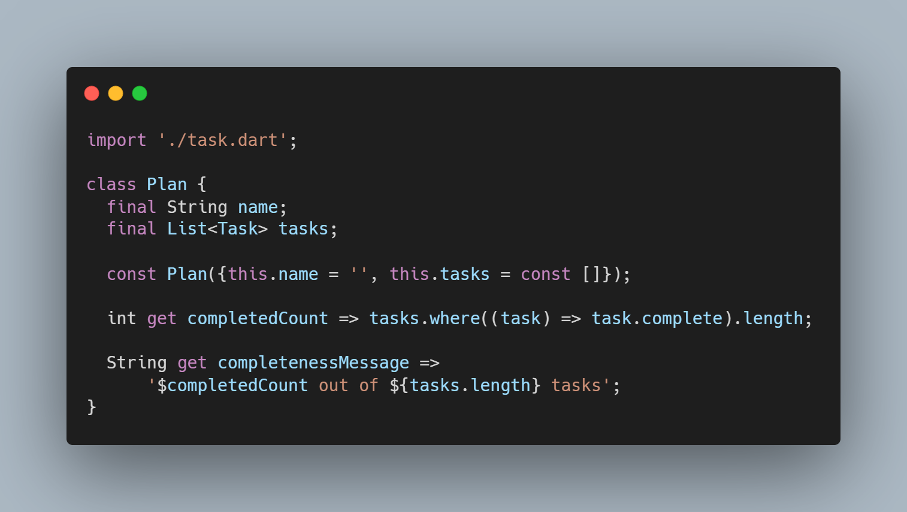
- ## plan_screen.dart
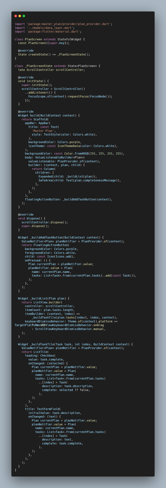
# Output
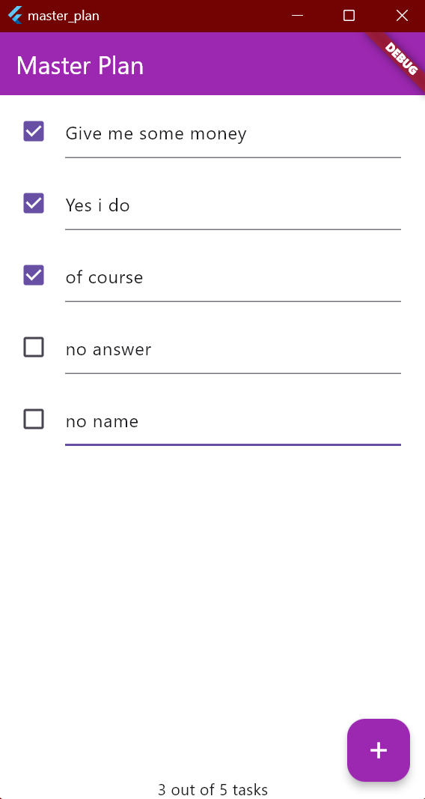

2. Jelaskan mana yang dimaksud InheritedWidget pada langkah 1 tersebut! Mengapa yang digunakan InheritedNotifier?
- Jawab: Pada langkah 1, `InheritedWidget` digunakan sebagai kelas dasar untuk membuat `PlanProvider`, yang memungkinkan data tertentu diakses oleh widget lainnya dalam satu hirarki. Namun, `InheritedNotifier` dipilih di sini sebagai turunan `InheritedWidget` dengan tambahan kemampuan untuk merespons perubahan dari `ValueNotifier`, dalam hal ini `ValueNotifier<Plan>`. `InheritedNotifier` memberi tahu widget-widget yang mengakses `PlanProvider` agar memperbarui tampilan mereka hanya ketika nilai `Plan` berubah, sehingga lebih efisien daripada `InheritedWidget` biasa yang cocok untuk data statis atau yang tidak sering berubah. Hal ini memungkinkan aplikasi untuk memperbarui tampilan secara otomatis ketika ada perubahan pada `Plan`, tanpa memicu pembaruan berlebih yang dapat menurunkan kinerja.

3. Jelaskan maksud dari method di langkah 3 pada praktikum tersebut! Mengapa dilakukan demikian?
- Jawab: Pada langkah 3, ditambahkan dua method getter (`completedCount` dan `completenessMessage`) ke dalam model `Plan` untuk mempermudah akses data terkait progres tugas. `completedCount` menghitung jumlah tugas yang sudah selesai dengan memfilter elemen `tasks` yang memiliki atribut `complete` bernilai `true` dan menghitungnya dengan `.length`. Sementara itu, `completenessMessage` menghasilkan pesan dalam format yang mudah dibaca, seperti “3 out of 5 tasks,” yang menunjukkan berapa banyak tugas yang sudah diselesaikan dari total yang ada. Kedua getter ini digunakan untuk mempermudah dan menstrukturkan akses data, sehingga kode menjadi lebih ringkas, mudah dibaca, dan siap digunakan di antarmuka pengguna tanpa harus menghitung ulang atau mengonversi data setiap kali dibutuhkan.

4. Lakukan capture hasil dari Langkah 9 berupa GIF, kemudian jelaskan apa yang telah Anda buat!
- Jawab: Langkah 9 menambahkan widget `SafeArea` di akhir widget `Column` dalam metode `build`, berfungsi untuk menampilkan `completenessMessage` pada area aman layar agar teks tidak terhalang oleh elemen seperti notch atau status bar. `SafeArea` ini menampilkan progres penyelesaian tugas, misalnya "3 out of 5 tasks," di bagian bawah layar. `ValueListenableBuilder` digunakan untuk memantau perubahan pada `Plan` yang diambil dari `PlanProvider`, sehingga ketika tugas ditandai selesai atau ditambah, tampilan pesan progres akan otomatis diperbarui. Jika hasil langkah ini ditunjukkan dalam bentuk GIF, maka akan terlihat antarmuka aplikasi dengan daftar tugas, beserta pembaruan otomatis pada teks progres di bagian bawah setiap kali ada perubahan pada tugas.

5. Kumpulkan laporan praktikum Anda berupa link commit atau repository GitHub ke dosen yang telah disepakati !
- Jawab: Sudah

# Tugas Praktikum 3
1. Selesaikan langkah-langkah praktikum tersebut, lalu dokumentasikan berupa GIF hasil akhir praktikum beserta penjelasannya di file README.md! Jika Anda menemukan ada yang error atau tidak berjalan dengan baik, silakan diperbaiki sesuai dengan tujuan aplikasi tersebut dibuat.
# Kode Program:
- ## plan_provider.dart
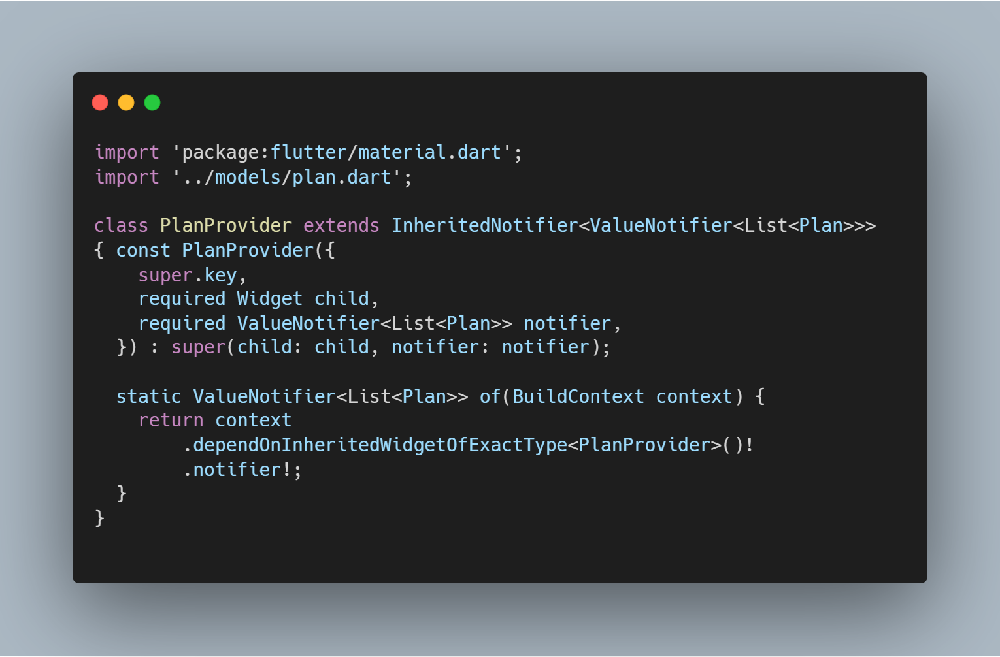
- ## main.dart
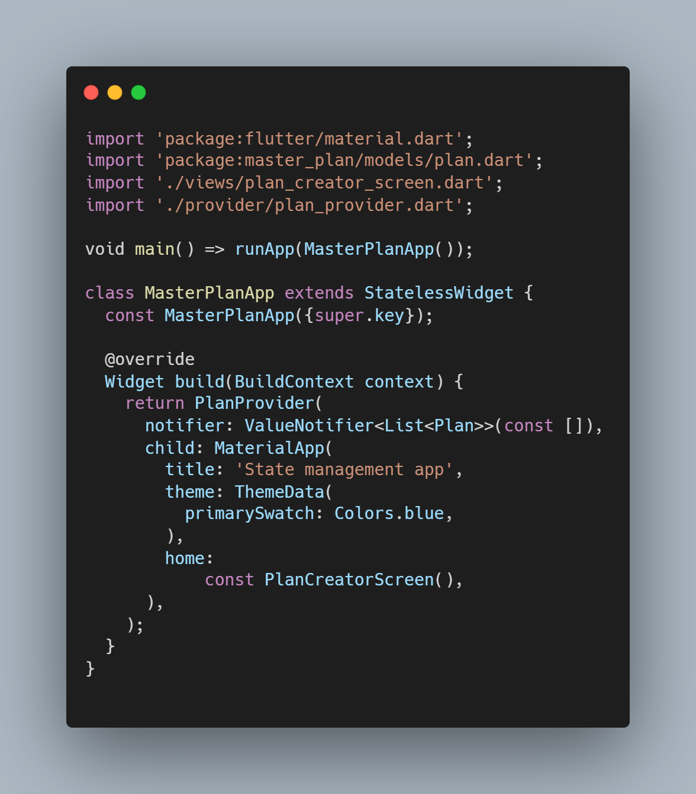
- ## plan_screen.dart

- ## plan_creator_screen.dart
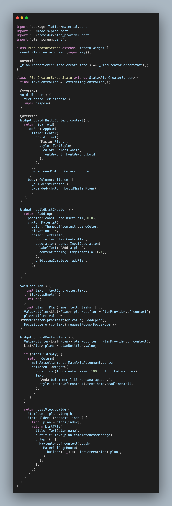
# Output
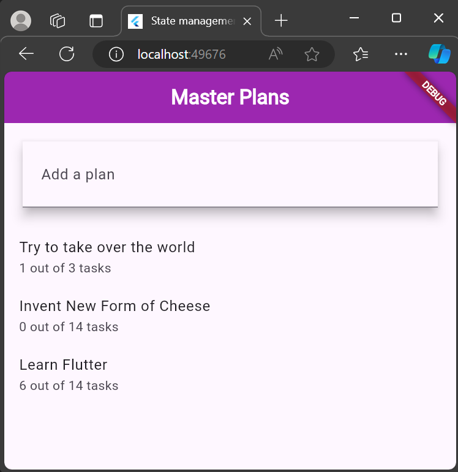
2. Berdasarkan Praktikum 3 yang telah Anda lakukan, jelaskan maksud dari gambar diagram berikut ini!

Gambar tersebut menunjukkan diagram struktur widget/komponen dalam aplikasi Flutter yang terdiri dari dua bagian (sebelah kiri dan kanan) yang terhubung dengan "Navigator Push". Mari saya jelaskan secara detail:

Bagian Kiri (Biru):
1. MaterialApp sebagai root widget
2. PlanProvider sebagai state management
3. PlanCreatorScreen sebagai layar pembuatan plan
4. Column sebagai layout vertikal yang berisi:
   - TextField untuk input
   - Expanded yang memiliki ListView untuk menampilkan daftar

Bagian Kanan (Hijau):
1. MaterialApp sebagai root widget 
2. PlanScreen sebagai layar detail plan
3. Scaffold sebagai kerangka dasar halaman
4. Column sebagai layout vertikal yang berisi:
   - Expanded dengan ListView untuk menampilkan daftar
   - SafeArea dengan Text untuk menampilkan teks

"Navigator Push" di tengah menandakan bahwa ketika pengguna melakukan aksi tertentu di layar kiri (PlanCreatorScreen), aplikasi akan berpindah/navigate ke layar kanan (PlanScreen).

Diagram ini menggambarkan alur navigasi dan struktur widget dari dua layar utama dalam aplikasi:
1. Layar pertama untuk membuat rencana/plan baru
2. Layar kedua untuk menampilkan dan mengelola detail dari plan tersebut

Setiap kotak dalam diagram merepresentasikan widget Flutter yang digunakan untuk membangun antarmuka pengguna. Struktur hierarki (parent-child) ditunjukkan dengan garis penghubung vertikal, dimana widget yang berada di atas adalah parent dari widget-widget di bawahnya.

3. Lakukan capture hasil dari Langkah 14 berupa GIF, kemudian jelaskan apa yang telah Anda buat!
- Jawab: Pada Langkah 14, widget `_buildMasterPlans()` dibuat untuk menampilkan daftar rencana pengguna. Dengan menggunakan `ValueNotifier`, widget ini memantau perubahan data rencana dan menampilkan daftar menggunakan `ListView.builder`. Jika tidak ada rencana, akan ditampilkan pesan "Anda belum memiliki rencana apapun" bersama ikon yang menggambarkan ketiadaan rencana. Namun, jika ada rencana, daftar rencana yang tersedia akan ditampilkan lengkap dengan nama rencana dan pesan kelengkapannya. Pengguna dapat mengetuk salah satu item dalam daftar untuk melihat detail lebih lanjut di halaman `PlanScreen`. Widget ini memberikan pengalaman interaktif bagi pengguna dalam mengelola rencana mereka.

4. Kumpulkan laporan praktikum Anda berupa link commit atau repository GitHub ke dosen yang telah disepakati !
- Jawab: Sudah

## Getting Started

This project is a starting point for a Flutter application.

A few resources to get you started if this is your first Flutter project:

- [Lab: Write your first Flutter app](https://docs.flutter.dev/get-started/codelab)
- [Cookbook: Useful Flutter samples](https://docs.flutter.dev/cookbook)

For help getting started with Flutter development, view the
[online documentation](https://docs.flutter.dev/), which offers tutorials,
samples, guidance on mobile development, and a full API reference.
