# books_application

A new Flutter project.

# Nama: Tirta Nurrochman Bintang Prawira
# NIM: 2241720045
# Kelas/Absen: TI-3A/27

- Soal 1
- Tambahkan nama panggilan Anda pada title app sebagai identitas hasil pekerjaan Anda.
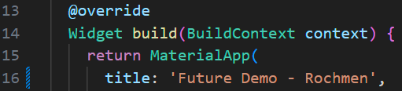

- Soal 2
- Carilah judul buku favorit Anda di Google Books, lalu ganti ID buku pada variabel path di kode tersebut. Caranya ambil di URL browser Anda seperti gambar berikut ini.
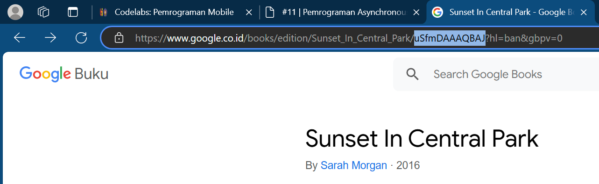
- Kemudian cobalah akses di browser URI tersebut dengan lengkap seperti ini. Jika menampilkan data JSON, maka Anda telah berhasil. Lakukan capture milik Anda dan tulis di README pada laporan praktikum. Lalu lakukan commit dengan pesan "W11: Soal 2".
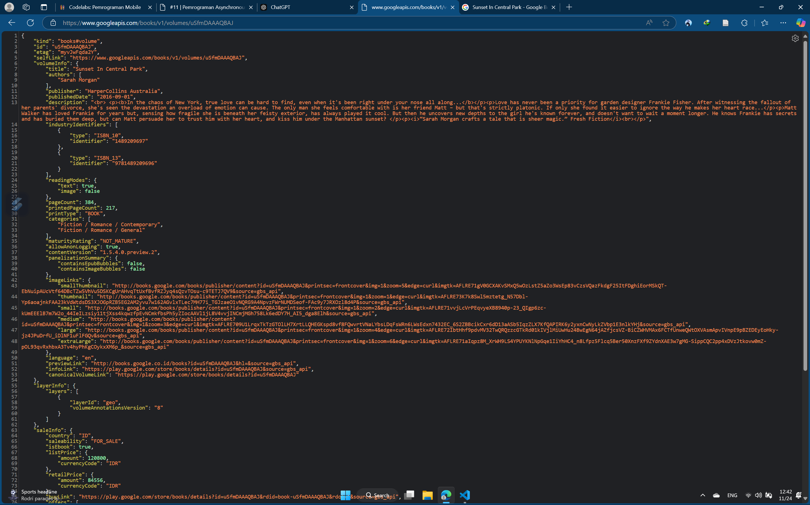

- Soal 3
- Jelaskan maksud kode langkah 5 tersebut terkait substring dan catchError!
- Jawab: Kode `substring(0, 450)` digunakan untuk membatasi panjang teks hasil respons API agar hanya menampilkan 450 karakter pertama, menjaga tampilan UI tetap rapi dan tidak kelebihan informasi. Sementara itu, `catchError` digunakan untuk menangani kesalahan yang mungkin terjadi saat mengambil data (seperti masalah koneksi atau server tidak responsif), sehingga aplikasi tidak crash dan dapat menampilkan pesan error yang informatif kepada pengguna. Kedua fitur ini memastikan aplikasi tetap stabil dan user-friendly meskipun menghadapi error atau data besar.
- Capture hasil praktikum Anda berupa GIF dan lampirkan di README. Lalu lakukan commit dengan pesan "W11: Soal 3".
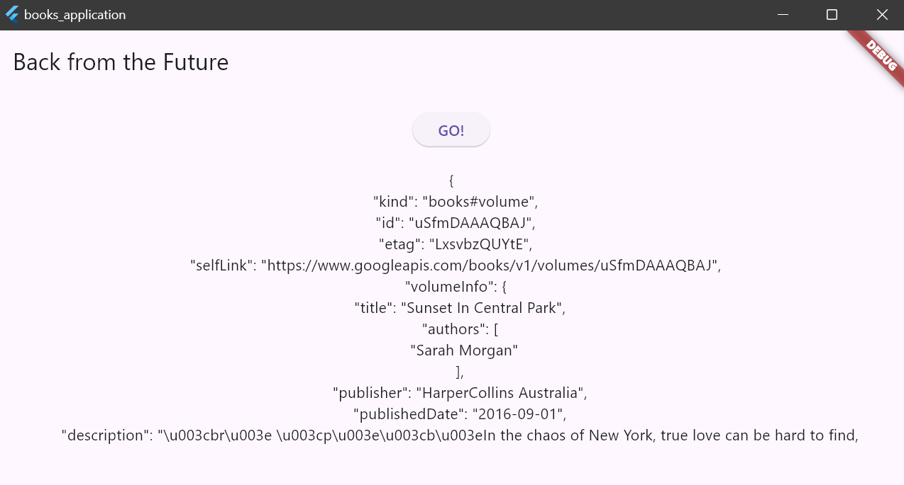

- Soal 4
- Jelaskan maksud kode langkah 1 dan 2 tersebut!
- Jawab: **Langkah 1**
Tiga metode (`returnOneAsync`, `returnTwoAsync`, `returnThreeAsync`) adalah fungsi asynchronous yang mensimulasikan tugas latar belakang seperti mengambil data dari server. Setiap metode menunggu 3 detik menggunakan `Future.delayed` lalu mengembalikan nilai integer tertentu (masing-masing 1, 2, dan 3). Fungsi ini penting untuk mempelajari cara menangani operasi asynchronous dalam Flutter tanpa memblokir UI.
- **Langkah 2**
Metode `count` digunakan untuk menjumlahkan hasil dari ketiga fungsi asynchronous tadi. Dengan `await`, aplikasi menunggu setiap fungsi selesai secara berurutan sebelum menambahkan nilainya ke variabel `total`. Setelah semua selesai, nilai `total` diubah menjadi string dan diperbarui ke UI menggunakan `setState()`. Tujuannya adalah untuk mempraktikkan pengelolaan hasil dari beberapa operasi asynchronous.
- Capture hasil praktikum Anda berupa GIF dan lampirkan di README. Lalu lakukan commit dengan pesan "W11: Soal 4".
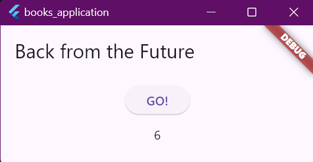

- Soal 5
- Jelaskan maksud kode langkah 2 tersebut!
- Jawab: Kode ini menggunakan `Completer` untuk mengelola proses asynchronous secara manual. Objek `Completer` diinisialisasi dalam metode `getNumber` dan menghasilkan sebuah `Future` yang akan diselesaikan secara eksplisit. Metode `calculate` mensimulasikan proses asynchronous dengan menunda eksekusi selama 5 detik menggunakan `Future.delayed`, lalu menyelesaikan `Future` tersebut dengan nilai `42` melalui `completer.complete(42)`. Pendekatan ini memungkinkan kontrol penuh atas kapan dan bagaimana sebuah operasi asynchronous diselesaikan, menjadikannya berguna untuk skenario yang bergantung pada kondisi atau proses tertentu.
- Capture hasil praktikum Anda berupa GIF dan lampirkan di README. Lalu lakukan commit dengan pesan "W11: Soal 5".
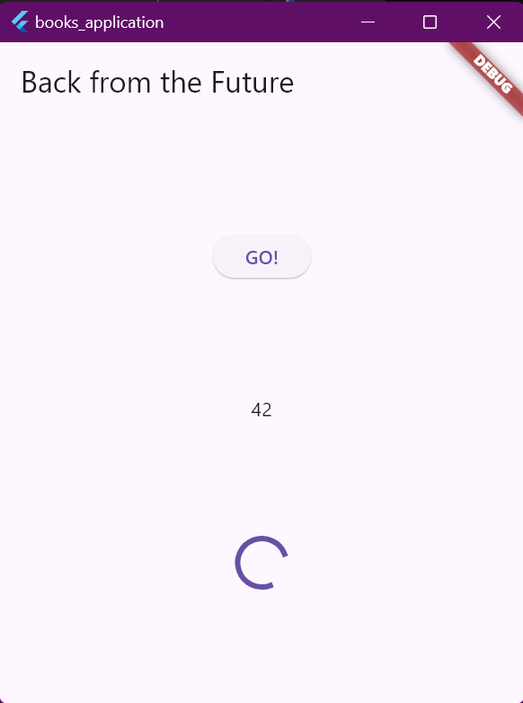

- Soal 6
- Jelaskan maksud perbedaan kode langkah 2 dengan langkah 5-6 tersebut!
- Jawab: **Langkah 5**
- Pada langkah ini, fungsi `calculate` digunakan untuk mengelola penyelesaian `Future` secara manual dengan `Completer`. Proses ini melibatkan penundaan selama 5 detik menggunakan `Future.delayed`, kemudian menyelesaikan `Future` dengan nilai `42` melalui `completer.complete(42)`. Jika terjadi kesalahan selama proses, blok `try-catch` akan menangkap error, dan `completer.completeError` digunakan untuk menyelesaikan `Future` dengan pesan error. Dengan pendekatan ini, fungsi `calculate` memberikan kontrol eksplisit atas hasil dan error yang terjadi selama eksekusi asynchronous.
- **Langkah 6:**  
- Langkah ini menangani hasil `Future` yang dibuat oleh `Completer` menggunakan mekanisme callback `then` dan `catchError`. Callback `then` dijalankan ketika `Future` berhasil diselesaikan, mengambil nilai hasil (misalnya, `42`) dan memperbarui UI dengan nilai tersebut. Sebaliknya, jika `Future` selesai dengan error (misalnya dari `completer.completeError`), callback `catchError` akan menangani kesalahan tersebut dan memperbarui UI dengan pesan error. Langkah ini berfungsi untuk memastikan hasil atau error dari `Future` diproses dan ditampilkan dengan benar kepada pengguna.
- Capture hasil praktikum Anda berupa GIF dan lampirkan di README. Lalu lakukan commit dengan pesan "W11: Soal 6".
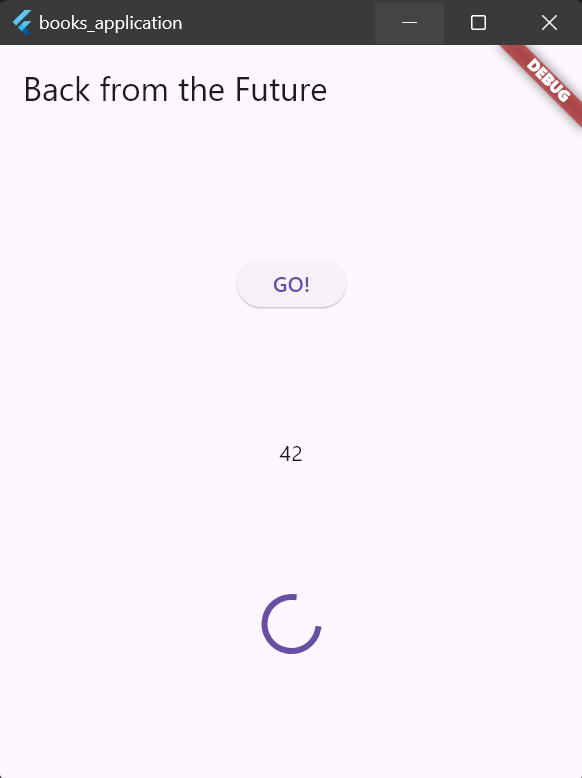

- Soal 7
- Capture hasil praktikum Anda berupa GIF dan lampirkan di README. Lalu lakukan commit dengan pesan "W11: Soal 7".
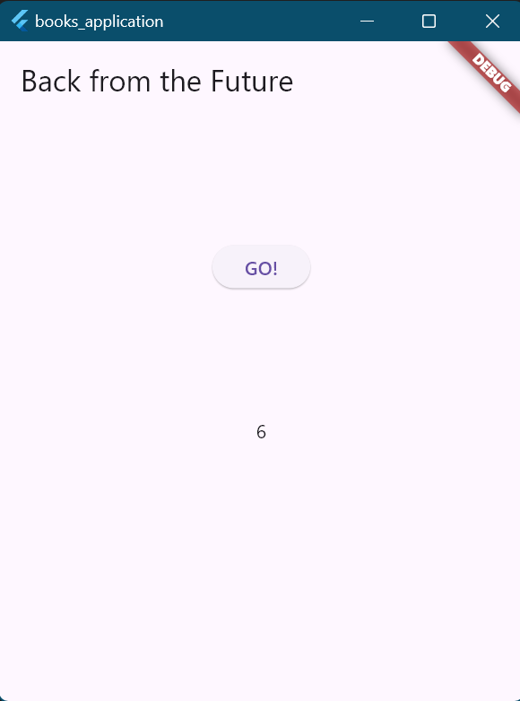
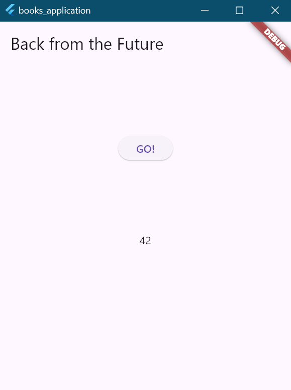

- Soal 8
- Jelaskan maksud perbedaan kode langkah 1 dan 4!
- Jawab: **Langkah 1** menggunakan **`FutureGroup`**, sebuah library dari package **`async`**, untuk mengelola sekumpulan Future yang berjalan paralel. Setiap Future ditambahkan secara eksplisit menggunakan metode **`add`**, kemudian kelompok Future ditutup menggunakan **`close`** untuk menandakan bahwa tidak ada Future tambahan yang akan ditambahkan. Setelah semua Future selesai, hasilnya diakses sebagai daftar yang diproses menggunakan perulangan manual untuk menjumlahkan nilai-nilai.
- **Langkah 4** memanfaatkan **`Future.wait`**, fitur bawaan Dart, untuk menjalankan dan menunggu sekumpulan Future secara paralel. Future diatur dalam sebuah daftar, dan hasilnya langsung tersedia sebagai daftar setelah semua selesai. Proses penjumlahan nilai dilakukan dengan lebih ringkas menggunakan metode **`reduce`**. Selain itu, error handling ditambahkan menggunakan **`catchError`** untuk menangkap kesalahan dari salah satu Future dalam grup. Pendekatan ini lebih sederhana dan efisien karena tidak memerlukan dependensi eksternal.

- Soal 9
- Capture hasil praktikum Anda berupa GIF dan lampirkan di README. Lalu lakukan commit dengan pesan "W11: Soal 9".
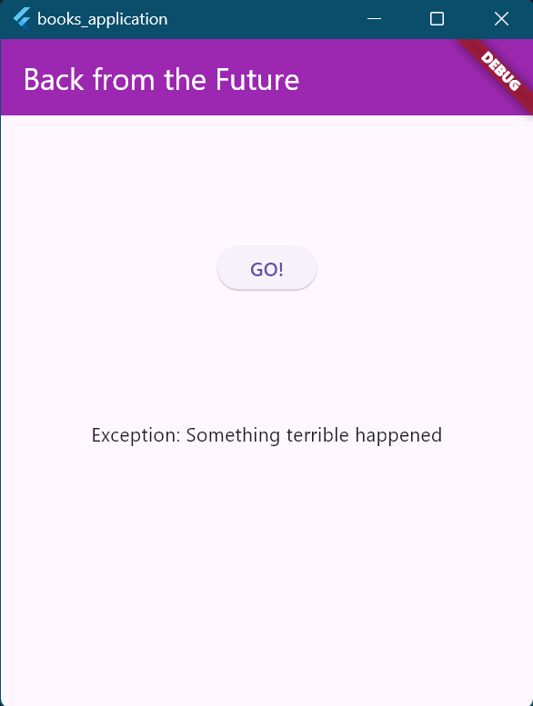
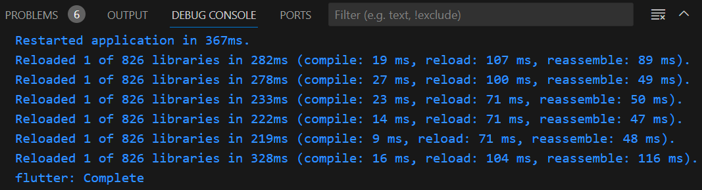

## Getting Started

This project is a starting point for a Flutter application.

A few resources to get you started if this is your first Flutter project:

- [Lab: Write your first Flutter app](https://docs.flutter.dev/get-started/codelab)
- [Cookbook: Useful Flutter samples](https://docs.flutter.dev/cookbook)

For help getting started with Flutter development, view the
[online documentation](https://docs.flutter.dev/), which offers tutorials,
samples, guidance on mobile development, and a full API reference.
