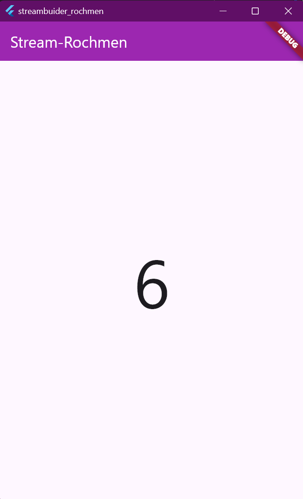

# streambuider_rochmen

A new Flutter project.

# Nama: Tirta Nurrochman Bintang Prawira
# NIM: 2241720045
# Kelas/Absen: TI-3A/27

### Soal 1
- Jelaskan maksud kode pada langkah 3 dan 7 !
- Kode pada langkah 3 dan 7 bekerja sama untuk menghasilkan tampilan angka acak yang terus berubah pada layar aplikasi. Langkah 3 menciptakan sebuah aliran data (stream) yang menghasilkan angka-angka acak secara berkala. Aliran data ini kemudian dihubungkan ke komponen StreamBuilder pada langkah 7. StreamBuilder bertugas mendengarkan perubahan pada aliran data tersebut dan setiap kali ada angka baru, StreamBuilder akan memperbarui tampilan layar dengan angka acak yang terbaru. Dengan cara ini, aplikasi Anda akan selalu menampilkan angka acak yang selalu berubah.
- Capture hasil praktikum Anda berupa GIF dan lampirkan di README.

- Lalu lakukan commit dengan pesan "W12: Jawaban Soal 12".

## Getting Started

This project is a starting point for a Flutter application.

A few resources to get you started if this is your first Flutter project:

- [Lab: Write your first Flutter app](https://docs.flutter.dev/get-started/codelab)
- [Cookbook: Useful Flutter samples](https://docs.flutter.dev/cookbook)

For help getting started with Flutter development, view the
[online documentation](https://docs.flutter.dev/), which offers tutorials,
samples, guidance on mobile development, and a full API reference.
