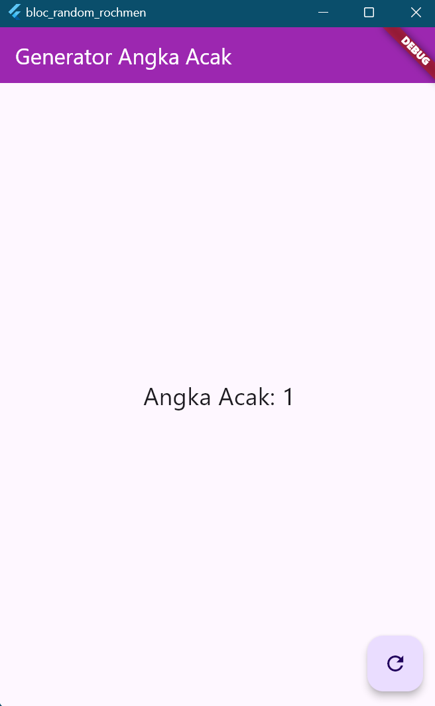

# bloc_random_rochmen

A new Flutter project.

# Nama: Tirta Nurrochman Bintang Prawira
# NIM: 2241720045
# Kelas/Absen: TI-3A/27

### Soal 1
- Jelaskan maksud praktikum ini ! Dimanakah letak konsep pola BLoC-nya ?
- Praktikum ini bertujuan untuk memperkenalkan konsep BLoC dalam pengembangan aplikasi Flutter melalui pembuatan aplikasi sederhana generator angka acak. BLoC memisahkan logika bisnis (menghasilkan angka acak) dengan tampilan (antarmuka pengguna). Kelas RandomNumberBloc bertindak sebagai otak yang mengelola state dan menerima perintah untuk menghasilkan angka baru. Sementara itu, StreamBuilder dalam random_screen.dart berfungsi sebagai penghubung antara UI dan BLoC, memperbarui tampilan secara real-time setiap kali ada perubahan pada angka acak. Dengan demikian, kita dapat membangun aplikasi yang lebih terstruktur, mudah diuji, dan mudah dipelihara.
- Intinya, praktikum ini memberikan pemahaman dasar tentang bagaimana menerapkan pola arsitektur BLoC dalam pengembangan aplikasi Flutter. Konsep BLoC sangat berguna untuk mengelola kompleksitas aplikasi yang lebih besar dan menjaga kode tetap terorganisir.
- Capture hasil praktikum Anda berupa GIF dan lampirkan di README.

- Lalu lakukan commit dengan pesan "W12: Jawaban Soal 13".

## Getting Started

This project is a starting point for a Flutter application.

A few resources to get you started if this is your first Flutter project:

- [Lab: Write your first Flutter app](https://docs.flutter.dev/get-started/codelab)
- [Cookbook: Useful Flutter samples](https://docs.flutter.dev/cookbook)

For help getting started with Flutter development, view the
[online documentation](https://docs.flutter.dev/), which offers tutorials,
samples, guidance on mobile development, and a full API reference.
