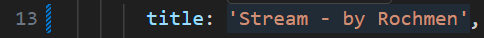
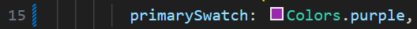
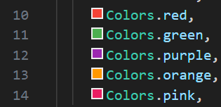
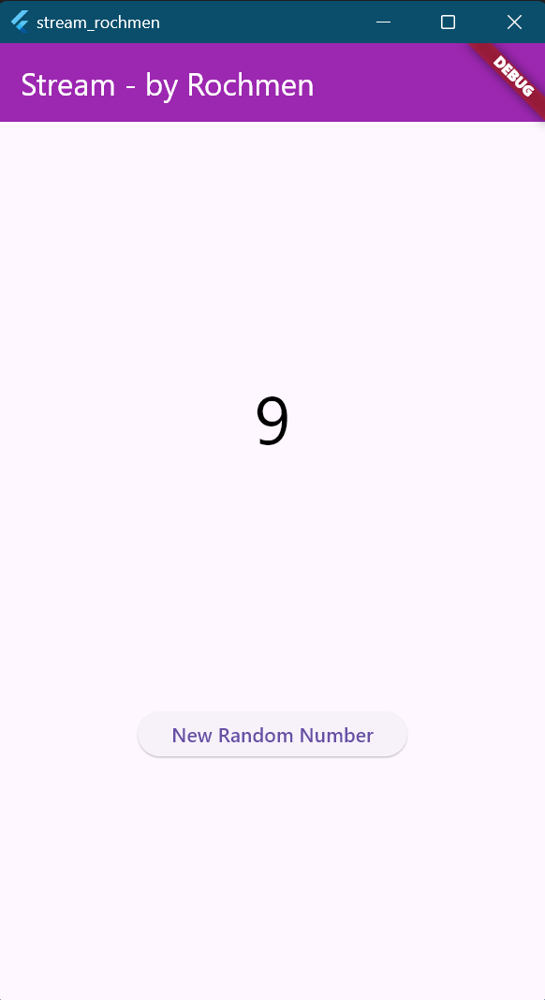
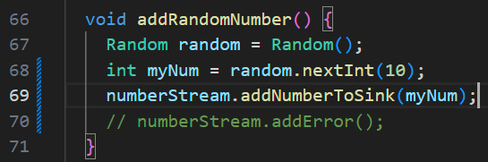
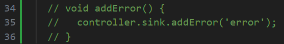
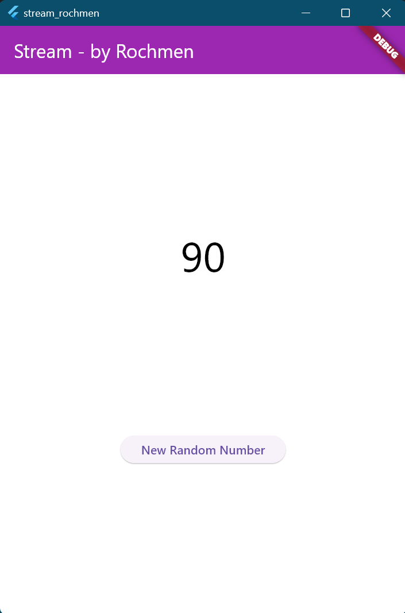
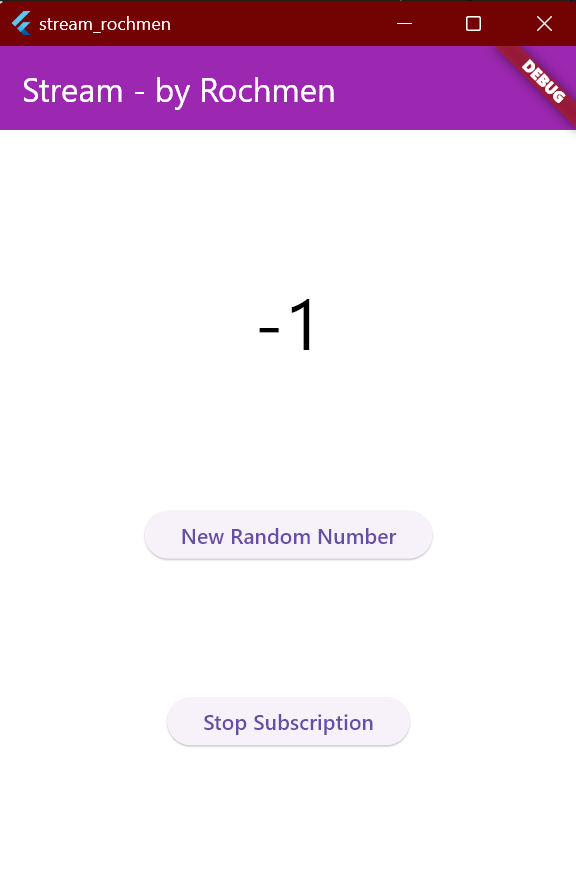
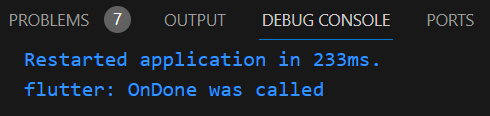
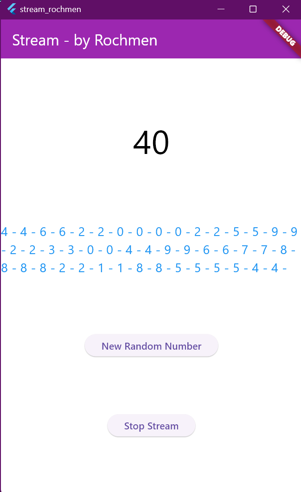

# stream_rochmen

A new Flutter project.

# Nama: Tirta Nurrochman Bintang Prawira
# NIM: 2241720045
# Kelas/Absen: TI-3A/27

### Soal 1
- Tambahkan nama panggilan Anda pada title app sebagai identitas hasil pekerjaan Anda.

- Gantilah warna tema aplikasi sesuai kesukaan Anda.

- Lakukan commit hasil jawaban Soal 1 dengan pesan "W12: Jawaban Soal 1"

### Soal 2
- Tambahkan 5 warna lainnya sesuai keinginan Anda pada variabel colors tersebut.

- Lakukan commit hasil jawaban Soal 2 dengan pesan "W12: Jawaban Soal 2"

### Soal 3
- Jelaskan fungsi keyword yield* pada kode tersebut!
- Jawab: `yield*` pada kode tersebut digunakan untuk mengirimkan seluruh elemen dari stream lain ke dalam stream utama secara langsung. Dengan menggunakan `yield*`, elemen yang dihasilkan dari `Stream.periodic(...)` akan diteruskan ke stream utama `getColors()` tanpa perlu mengambil setiap elemen secara manual, sehingga seluruh hasil dari stream periodik ini dapat dikirimkan ke stream utama secara efisien.
- Apa maksud isi perintah kode tersebut?
- Jawab: Kode `Stream.periodic(const Duration(seconds: 1), (int t) {...})` menghasilkan sebuah stream yang mengirimkan data setiap detik. Fungsi `(int t) { int index = t % colors.length; return colors[index]; }` digunakan untuk mengambil warna dari daftar `colors` secara berurutan dengan memodulasi indeks terhadap panjang daftar, memastikan bahwa warna akan diulang ketika mencapai akhir daftar. Hasilnya, setiap detik `getColors()` akan mengirimkan warna baru, secara terus-menerus mengulang daftar warna.
- Lakukan commit hasil jawaban Soal 3 dengan pesan "W12: Jawaban Soal 3"

### Soal 4
- Capture hasil praktikum Anda berupa GIF dan lampirkan di README.

- Lakukan commit hasil jawaban Soal 4 dengan pesan "W12: Jawaban Soal 4"

### Soal 5
- Jelaskan perbedaan menggunakan listen dan await for (langkah 9) !
- Jawab: Perbedaan utama antara `await for` dan `listen` adalah pada cara mereka menangani elemen dalam stream secara asynchronous. `await for` digunakan dalam fungsi `async` untuk menunggu setiap elemen dari stream satu per satu, cocok untuk stream yang mungkin berakhir secara otomatis karena loop akan berhenti saat stream selesai. Di sisi lain, `listen` tidak memerlukan `await` dan biasanya digunakan untuk mendengarkan stream yang terus berjalan tanpa batas waktu. `listen` juga menawarkan fleksibilitas tambahan, seperti opsi `onDone` untuk menangani saat stream selesai dan `onError` untuk menangani kesalahan.
- Lakukan commit hasil jawaban Soal 5 dengan pesan "W12: Jawaban Soal 5"

### Soal 6
- Jelaskan maksud kode langkah 8 dan 10 tersebut!
- Jawab: Pada langkah ini, fungsi `initState()` digunakan untuk mempersiapkan pengelolaan stream yang akan memproses data secara real-time. Pertama, `NumberStream` diinisialisasi sebagai sumber data, dan `StreamController` diatur untuk mengelola aliran data tersebut. Selanjutnya, sebuah *listener* ditambahkan ke `Stream` untuk mendengarkan setiap data baru yang masuk. Ketika data diterima, aplikasi akan memperbarui nilai variabel `lastNumber` dan memanggil `setState()` untuk memastikan bahwa UI diperbarui sesuai dengan data terbaru. Dengan langkah ini, aplikasi menjadi siap untuk menangani pembaruan data secara langsung dari stream.
- Fungsi `addRandomNumber()` digunakan untuk menghasilkan angka acak baru yang kemudian dimasukkan ke dalam stream. Proses dimulai dengan membuat objek `Random` untuk menghasilkan angka acak dalam rentang 0–9. Angka tersebut kemudian ditambahkan ke stream menggunakan metode `addNumberToSink()` dari `NumberStream`. Fungsi ini menjadi mekanisme utama untuk mengirim data baru ke stream, sehingga listener pada langkah sebelumnya dapat memproses dan memperbarui UI sesuai dengan data yang diterima.
- Capture hasil praktikum Anda berupa GIF dan lampirkan di README.

- Lalu lakukan commit dengan pesan "W12: Jawaban Soal 6".

### Soal 7
- Jelaskan maksud kode langkah 13 sampai 15 tersebut!
- Jawab: Langkah 13: Metode `addError()` digunakan untuk menambahkan error ke dalam sink dari stream. Dengan memanggil `controller.sink.addError('error')`, stream akan mengirimkan sebuah error (dalam hal ini berupa string `'error'`) kepada pendengar stream. Hal ini berguna untuk mengelola skenario error dalam aplikasi berbasis stream.

- Langkah 14: Di langkah ini, fungsi `stream.listen()` digunakan untuk mendengarkan data atau error yang dikirim oleh stream. Jika ada data baru (`event`), aplikasi akan memperbarui state dengan nilai tersebut melalui `setState()`. Namun, jika stream mengirimkan error, callback `onError()` akan dipicu, dan aplikasi akan memperbarui state dengan nilai `-1` sebagai penanda bahwa error terjadi.

- Langkah 15: Fungsi `addRandomNumber()` sebelumnya bertugas menghasilkan angka acak dan menambahkannya ke dalam stream menggunakan `addNumberToSink()`. Namun, pada langkah ini, alih-alih menambahkan angka, fungsi tersebut langsung memanggil metode `addError()` untuk memicu error di stream. Ini digunakan untuk menguji atau mensimulasikan bagaimana aplikasi menangani error yang dikirimkan oleh stream.
- Kembalikan kode seperti semula pada Langkah 15, comment addError() agar Anda dapat melanjutkan ke praktikum 3 berikutnya.
- 
- 
- Lalu lakukan commit dengan pesan "W12: Jawaban Soal 7".

### Soal 8
- Jelaskan maksud kode langkah 1-3 tersebut!
- Jawab: Kode pada langkah-langkah tersebut bertujuan untuk memproses data pada stream menggunakan `StreamTransformer` sebelum data diterima oleh listener. Pertama, variabel `transformer` dideklarasikan untuk mendefinisikan cara data diproses, termasuk pengolahan data (dalam hal ini mengalikan nilai dengan 10), menangani kesalahan (mengembalikan nilai `-1` jika terjadi error), dan menutup stream saat selesai. Transformer ini kemudian diterapkan pada stream di dalam metode `initState` menggunakan `.transform(transformer)`. Data yang telah diolah oleh transformer didengarkan melalui `listen`, dan setiap data baru diperbarui ke variabel `lastNumber` menggunakan `setState` untuk mengubah tampilan UI secara langsung. Jika terjadi error, nilai default `-1` ditampilkan.
- Capture hasil praktikum Anda berupa GIF dan lampirkan di README.
- 
- Lalu lakukan commit dengan pesan "W12: Jawaban Soal 8".

### Soal 9
- Jelaskan maksud kode langkah 2, 6 dan 8 tersebut!
- Jawab: Ketiga langkah di atas secara bersama-sama mengatur bagaimana aplikasi berinteraksi dengan stream. Langkah 2 mempersiapkan fondasi, langkah 6 membersihkan sumber daya, dan langkah 8 memastikan bahwa operasi pada stream dilakukan dengan aman dan efisien. Tujuan utamanya adalah untuk memastikan bahwa aplikasi dapat dengan baik mengelola data yang mengalir secara asinkron melalui stream.
- Capture hasil praktikum Anda berupa GIF dan lampirkan di README.
- 
- 
- Lalu lakukan commit dengan pesan "W12: Jawaban Soal 9".

### Soal 10
- Jelaskan mengapa error itu bisa terjadi ?
- Jawab: Error terjadi karena Stream default di Flutter hanya bisa didengarkan sekali, sehingga menambahkan lebih dari satu listener menyebabkan konflik. Solusinya adalah mengubah Stream menjadi **broadcast stream** menggunakan `StreamController.broadcast()` atau `stream.asBroadcastStream()` agar bisa memiliki banyak listener secara bersamaan.

### Soal 11
- Jelaskan mengapa hal itu bisa terjadi ?
- Jawab: Output menampilkan angka secara berulang, seperti `4 - 4 - 6 - 6`, karena ada dua listener (**subscription** dan **subscription2**) yang mendengarkan stream yang sama. Ketika stream mengirimkan sebuah event (angka), kedua listener menerima event tersebut secara bersamaan. Setiap listener menambahkan angka yang diterima ke variabel `values`. Akibatnya, setiap angka yang dihasilkan oleh stream muncul dua kali dalam output, satu dari setiap listener. 
- Capture hasil praktikum Anda berupa GIF dan lampirkan di README.
- 
- Lalu lakukan commit dengan pesan "W12: Jawaban Soal 10,11".

## Getting Started

This project is a starting point for a Flutter application.

A few resources to get you started if this is your first Flutter project:

- [Lab: Write your first Flutter app](https://docs.flutter.dev/get-started/codelab)
- [Cookbook: Useful Flutter samples](https://docs.flutter.dev/cookbook)

For help getting started with Flutter development, view the
[online documentation](https://docs.flutter.dev/), which offers tutorials,
samples, guidance on mobile development, and a full API reference.
