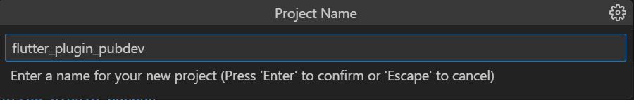
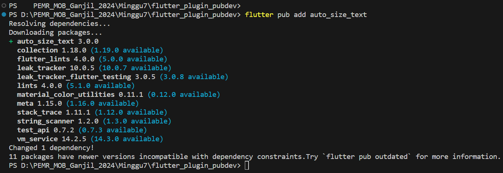
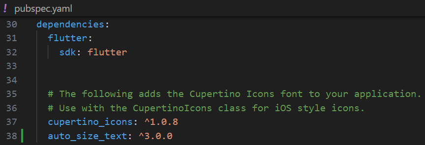
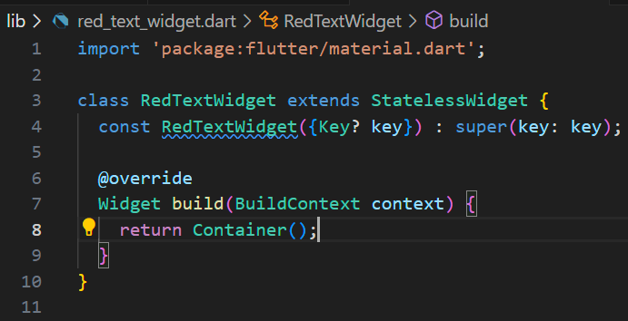
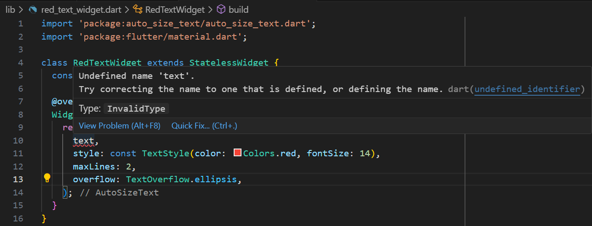
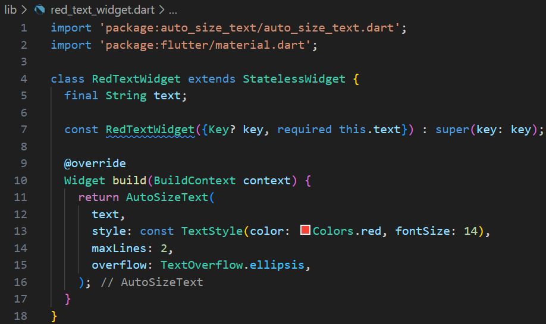
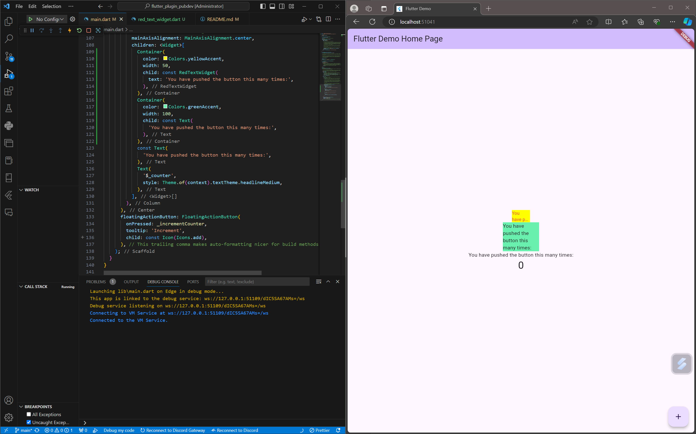

# flutter_plugin_pubdev

A new Flutter project.

# Nama: Tirta Nurrochman Bintang Prawira
# NIM: 2241720045
# Kelas/Absen: TI-3A/27

Praktikum 
- Langkah 1: Buat Project Baru

- Langkah 2: Menambahkan Plugin

- Langkah 3: Buat file red_text_widget.dart
- 

- Langkah 4: Tambah Widget AutoSizeText

Jawab: Info error tersebut terjadi dikarenakan variabel atau fungsi bernama **'text'** tidak didefinisikan di dalam kode. Untuk memperbaikinya, pastikan variabel **'text'** sudah didefinisikan.

- Langkah 5: Buat Variabel text dan parameter di construc`tor

- Langkah 6: Tambahkan widget di main.dart

Tugas Praktikum
1. Selesaikan Praktikum tersebut, lalu dokumentasikan dan push ke repository Anda berupa screenshot hasil pekerjaan beserta penjelasannya di file README.md! 
- **'sudah'**

2. Jelaskan maksud dari langkah 2 pada praktikum tersebut!
- Jawab: Langkah 2 pada praktikum tersebut bertujuan untuk menambahkan **plugin auto_size_text** ke dalam proyek Flutter. Plugin ini digunakan untuk membuat teks yang secara otomatis menyesuaikan ukurannya agar pas dengan ruang yang tersedia. Perintah **`flutter pub add auto_size_text`** akan menambahkan plugin ini ke file **pubspec.yaml** di bagian **dependencies**, yang akan mengatur agar proyek dapat menggunakan fitur dari plugin tersebut.

3. Jelaskan maksud dari langkah 5 pada praktikum tersebut!
- Jawab: Langkah 5 pada praktikum tersebut bertujuan untuk menambahkan **variabel text** ke dalam widget **RedTextWidget** agar teks yang ditampilkan dapat diatur dari luar widget. Dengan menambahkan variabel **`final String text;`**, widget ini akan memiliki sebuah properti yang menyimpan teks. Di dalam **constructor**, parameter **`required this.text`** digunakan untuk memastikan bahwa teks wajib diberikan ketika widget dibuat, sementara **`super(key: key)`** memanggil constructor dari kelas induk untuk menginisialisasi kunci widget (key).

4. Pada langkah 6 terdapat dua widget yang ditambahkan, jelaskan fungsi dan perbedaannya!
- Jawab:Fungsi kedua widget ini adalah untuk menampilkan teks, tetapi dengan perbedaan berikut:

1. **RedTextWidget**: Widget kustom yang mengatur teks melalui parameter **text** dan bisa memiliki gaya atau logika tambahan (misalnya, teks berwarna merah).
2. **Text**: Widget bawaan Flutter yang secara langsung menampilkan teks tanpa kustomisasi tambahan.

- **Perbedaan utamanya** adalah **RedTextWidget** memberikan fleksibilitas lebih karena dapat diubah atau ditambahkan fitur, sedangkan **Text** hanya untuk menampilkan teks secara sederhana.

5. Jelaskan maksud dari tiap parameter yang ada di dalam plugin auto_size_text berdasarkan tautan pada dokumentasi ini !
- Jawab: Plugin **auto_size_text** memiliki beberapa parameter utama yang mengontrol perilaku teks agar sesuai dengan batasan ruangnya. **`maxLines`** menentukan jumlah maksimal baris teks, sementara **`minFontSize`** dan **`maxFontSize`** mengatur ukuran huruf terkecil dan terbesar yang diizinkan. **`stepGranularity`** mengontrol seberapa besar langkah perubahan ukuran font, dan **`presetFontSizes`** memungkinkan penggunaan ukuran font yang sudah ditentukan sebelumnya, mengabaikan pengaturan minimum dan maksimum.

- Fitur lain termasuk **`group`**, yang mensinkronkan ukuran font beberapa widget dalam grup yang sama, serta **`overflowReplacement`**, yang menampilkan widget pengganti jika teks meluap. **`textAlign`, `overflow`, `softWrap`,** dan **`textDirection`** berfungsi sama seperti pada widget **Text** biasa, memberi fleksibilitas tambahan dalam penyesuaian teks.

6. Kumpulkan laporan praktikum Anda berupa link repository GitHub kepada dosen! 
- **'sudah'**

## Getting Started

This project is a starting point for a Flutter application.

A few resources to get you started if this is your first Flutter project:

- [Lab: Write your first Flutter app](https://docs.flutter.dev/get-started/codelab)
- [Cookbook: Useful Flutter samples](https://docs.flutter.dev/cookbook)

For help getting started with Flutter development, view the
[online documentation](https://docs.flutter.dev/), which offers tutorials,
samples, guidance on mobile development, and a full API reference.
