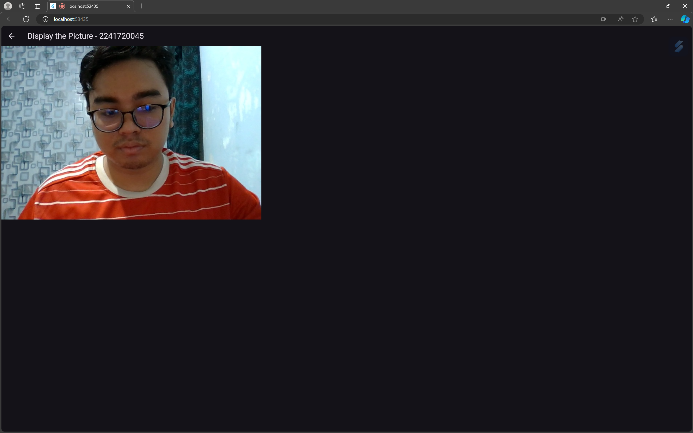
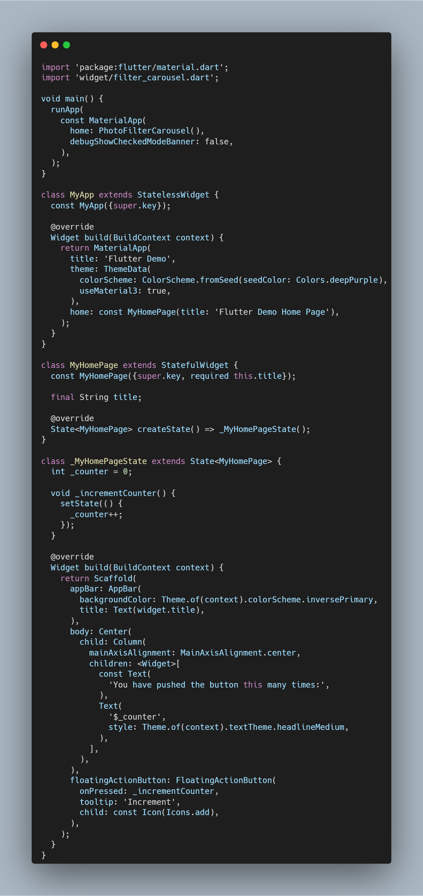
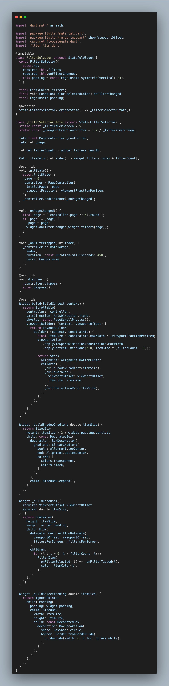
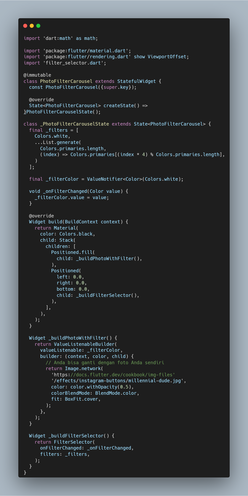
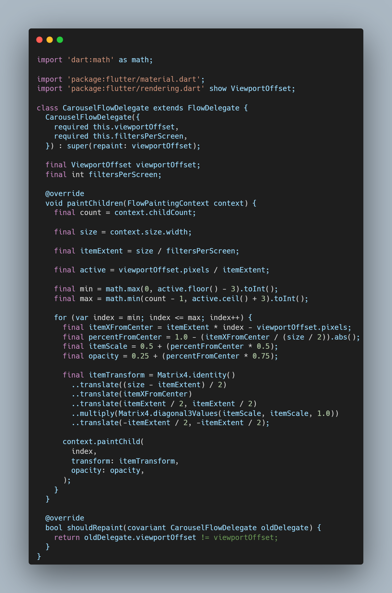
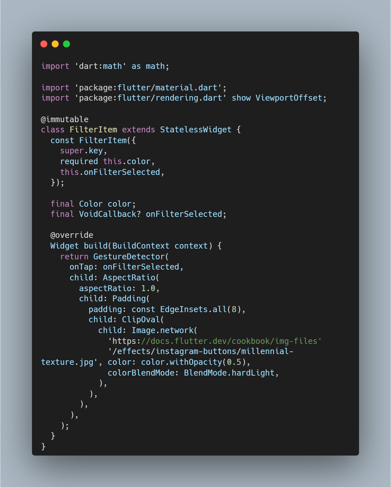
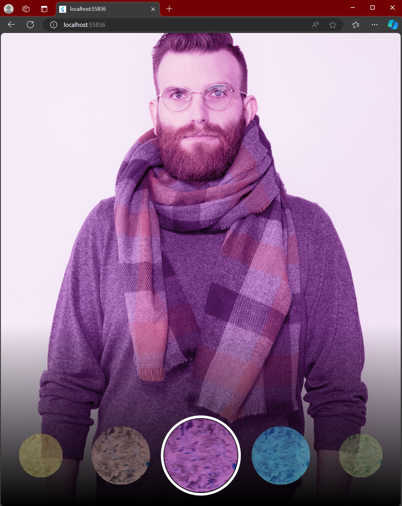

# photo_filter_carousel

A new Flutter project.

# Nama: Tirta Nurrochman Bintang Prawira
# NIM: 2241720045
# Kelas/Absen: TI-3A/27

# Tugas Praktikum
1. Selesaikan Praktikum 1 dan 2, lalu dokumentasikan dan push ke repository Anda berupa screenshot setiap hasil pekerjaan beserta penjelasannya di file README.md! Jika terdapat error atau kode yang tidak dapat berjalan, silakan Anda perbaiki sesuai tujuan aplikasi dibuat!
- # Praktikum 1
- ## main.dart
- Selanjutnya, kita perlu mengecek jumlah kamera yang tersedia pada perangkat menggunakan plugin camera seperti pada kode berikut ini. Kode ini letakkan dalam void main(). Ubah void main() menjadi async function seperti berikut ini. Pastikan melakukan impor plugin sesuai yang dibutuhkan.

- ## takepicture_screen.dart
- Setelah Anda dapat mengakses kamera, gunakan langkah-langkah berikut untuk membuat dan menginisialisasi CameraController. Pada langkah berikut ini, Anda akan membuat koneksi ke kamera perangkat yang memungkinkan Anda untuk mengontrol kamera dan menampilkan pratinjau umpan kamera. Gunakan widget CameraPreview dari package camera untuk menampilkan preview foto. Anda perlu tipe objek void berupa FutureBuilder untuk menangani proses async.

- ## displaypicture_screen.dart
- Buatlah file baru pada folder widget yang berisi kode berikut.

- ## Output:

- ## Output:

- # Praktikum 2
- ## main.dart
- Buatlah folder widget dan file baru yang berisi kode berikut.

- ## filter_selector.dart
- Buatlah folder widget dan file baru yang berisi kode berikut.

- ## filter_carousel.dart
- Buat file baru di folder widget dengan kode seperti berikut.

- ## carousel_flowdelegate.dart
- Buat file baru di folder widget dengan kode seperti berikut.

- ## filter_item.dart
- Buat file baru di folder widget dengan kode seperti berikut.

- ## Output:

2. Gabungkan hasil praktikum 1 dengan hasil praktikum 2 sehingga setelah melakukan pengambilan foto, dapat dibuat filter carouselnya!
- Jawab:

3. Jelaskan maksud void async pada praktikum 1?
- Pada praktikum 1, `void async` digunakan untuk mendeklarasikan sebuah fungsi yang bersifat **asynchronous** (berjalan di latar belakang) dan mengembalikan nilai **void**, yang berarti fungsi tersebut tidak mengembalikan nilai apapun.

Secara rinci:
- **`async`**: Menandakan bahwa fungsi ini akan melakukan operasi yang membutuhkan waktu, seperti pengambilan gambar atau permintaan data dari server, dan memungkinkan penggunaan **`await`** untuk menunggu hasilnya tanpa menghalangi bagian lain dari program.
- **`void`**: Menandakan bahwa fungsi ini tidak mengembalikan nilai (tidak ada hasil yang akan diberikan setelah fungsi selesai dijalankan).

Jadi, **`void async`** pada praktikum 1 artinya kita memiliki fungsi yang menjalankan proses asynchronous, seperti mengambil foto atau melakukan tugas yang memerlukan waktu, dan tidak mengembalikan nilai apapun setelah tugas tersebut selesai.

4. Jelaskan fungsi dari anotasi @immutable dan @override ?
- **`@immutable`**: Menandakan bahwa objek dari kelas ini tidak bisa diubah setelah dibuat. Semua propertinya harus bersifat `final` dan tidak bisa diganti nilainya setelah objek dibuat.

- **`@override`**: Digunakan untuk memberi tahu bahwa kita sengaja mengganti (menimpa) implementasi metode dari kelas induk. Anotasi ini memastikan bahwa kita benar-benar mengganti metode yang ada, dan membantu mencegah kesalahan penulisan.

5. Kumpulkan link commit repository GitHub Anda kepada dosen yang telah disepakati!
- Sudah

## Getting Started

This project is a starting point for a Flutter application.

A few resources to get you started if this is your first Flutter project:

- [Lab: Write your first Flutter app](https://docs.flutter.dev/get-started/codelab)
- [Cookbook: Useful Flutter samples](https://docs.flutter.dev/cookbook)

For help getting started with Flutter development, view the
[online documentation](https://docs.flutter.dev/), which offers tutorials,
samples, guidance on mobile development, and a full API reference.
